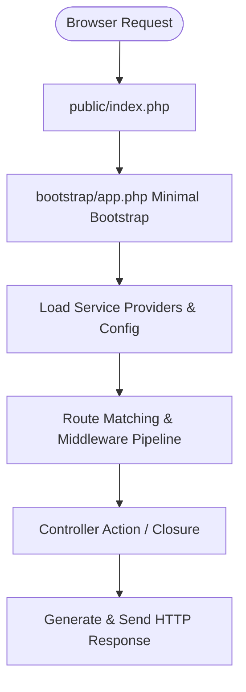

# Laravel Framework & Architecture Interview Questions & Answers

> [!TIP]
> সফটওয়্যার ইঞ্জিনিয়ার এবং লারাভেল ডেভেলপার ইন্টারভিউয়ের জন্য সর্বাধিক জিজ্ঞাসিত প্রশ্নাবলী (FAQ) এবং বিস্তারিত সমাধান। এখানে লারাভেল আর্কিটেকচার, সার্ভিস কন্টেইনার, মিডিলেওয়্যার, কিউ ও পারফরম্যান্স সম্পর্কিত গুরুত্বপূর্ণ বিষয়গুলো সহজ বাংলায় উপস্থাপন করা হয়েছে।

---

## 🌟 সিনিয়র Laravel ডেভেলপার এডভান্স টিপস (Senior Developer Mindset & Best Practices)

> [!IMPORTANT]
> **Laravel কেবল একটি ফ্রেমওয়ার্ক নয় — এটি এক ধরণের Developer Lifestyle!** একজন সিনিয়র ডেভেলপার কেবল কোড লেখেন না; তিনি পুরো সিস্টেমকে বোঝেন, গঠন করেন, অপ্টিমাইজ করেন এবং স্কেল করেন।

1. **Architecture First (কোডের আগে চিন্তা করুন):**
   - MVC-এর গণ্ডি পেরিয়ে **Service Layer, Repository Pattern, DTO (Data Transfer Object), Action Class** ব্যবহার করুন।
   - ডোমেইন অনুযায়ী কোড ভাগ করুন (**Domain Driven Design - DDD**)।
2. **Database Optimization & Query Strategy:**
   - **Lazy Loading Trap** থেকে সাবধান — সবসময় `with()` বা `load()` দিয়ে **Eager Loading** নিশ্চিত করুন।
   - বড় প্রজেক্টে **Read Replica Database** দিয়ে Query Load ভাগ করে দিন।
   - Heavy Query-এর জন্য **Database Indexing, Caching এবং Pagination Strategy** ফলো করুন।
3. **Performance Boost:**
   - `php artisan optimize` চালিয়ে Config, Routes, Views এবং Query ক্যালিব্রেট করুন।
   - **Redis** ক্যাশিং ব্যবহার করুন — রেসপন্স টাইম নাটকীয়ভাবে কমে যাবে।
   - **CDN (Cloudflare / AWS CloudFront)** দিয়ে Static Asset Serve করুন।
4. **Queue, Event & Job Handling:**
   - দীর্ঘ কাজের জন্য (যেমন: Email, Report Generation) বাধ্যতামূলক **Queue** ব্যবহার করুন।
   - **Event-Driven Architecture** অনুশীলন করুন। Queue Driver হিসেবে Redis বা AWS SQS ব্যবহার করুন।
   - **Supervisor** দিয়ে Background Workers ম্যানেজ করুন।
5. **Security & Validation Discipline:**
   - সব Request Validation **Form Request Class**-এ করুন, Controller-এ নয়।
   - `.env` ফাইল কখনই গিট কমিট করবেন না।
   - Hash, Rate Limiter, Policy, Gate-এর মতো বিল্ট-ইন সিকিউরিটি টুলস নিয়মিত ব্যবহার করুন।
6. **DevOps Mindset in Laravel:**
   - **CI/CD Workflow:** GitHub Actions বা GitLab CI দিয়ে অটোমেটেড ডিপ্লয়মেন্ট সেটআপ করুন।
   - `.env.example` আপডেটেড রাখুন এবং Secrets Manager ব্যবহার করুন।
   - **Dockerize** করে Local ও Production-এ অভিন্ন এনভায়রনমেন্ট তৈরি করুন।
7. **Testing = Confidence:**
   - Unit Test, Feature Test, Integration Test নিশ্চিত করুন।
   - **PestPHP** ব্যবহার করে টেস্ট কোড সহজ ও আনন্দদায়ক করুন।
8. **Code Review & Refactoring Habit:**
   - Code Review করুন, কেবল PUSH/MERGE করবেন না।
   - **DRY (Don’t Repeat Yourself)** নীতি মেনে চলুন। পুরনো কোড বাদ দেওয়ার চেয়ে রিফ্যাক্টর (Refactor) করুন।
9. **Logging & Monitoring:**
   - কেবল `laravel.log`-এ আটকে না থেকে Production Monitoring-এর জন্য **Sentry, Bugsnag, বা Laravel Telescope / Pulse** ব্যবহার করুন।
10. **Continuous Learning:**
    - লারাভেলের ইকোসিস্টেম প্রতিনিয়ত পরিবর্তনশীল — Horizon, Octane, Livewire, Inertia, Pulse চর্চা করুন এবং নিজের প্যাকেজ ডেভেলপ করুন।

---

## ১. লারাভেল কোর ও আর্কিটেকচার (Laravel Core & Architecture)

### Q1: Laravel Contracts কি?
**উত্তরাংশ:**
Laravel Contracts হলো ফ্রেমওয়ার্কের কোর সার্ভিসগুলোর জন্য সংজ্ঞায়িত কিছু **Interfaces**-এর সেট। 
যেমন: `Illuminate\Contracts\Mail\Mailer` ডিফাইন করে মেইল পাঠানোর জন্য কি কি মেথড লাগবে।

---

### Q2: Service Provider কি?
**উত্তরাংশ:**
Service Provider হলো লারাভেল অ্যাপ্লিকেশন বুটস্ট্র্যাপিংয়ের কেন্দ্রীয় স্থান।
* **কাজ:** Service Container-এ সার্ভিস বা ক্লাসের Binding রেজিস্টার করা, Event Listener, Middleware রেজিস্টার করা।
* **মেথড:** `register()` (কন্টেইনারে বাইন্ড করার জন্য) এবং `boot()` (সব সার্ভিস লোড হওয়ার পর চালানোর জন্য)।

---

### Q3: Facade Pattern কি এবং লারাভেলে Facades কীভাবে কাজ করে?
**উত্তরাংশ:**
* **Facade Pattern:** জটিল কোনো সাবসিস্টেমের মেথডগুলোকে একটি সহজ ও সংক্ষিপ্ত স্ট্যাটিক ইন্টারফেসের মাধ্যমে কল করার প্যাটার্ন।
* **লারাভেলে Facades:** `Cache::get()`, `DB::table()` ইত্যাদি লারাভেল ফাসাদ ব্যবহার করে। ব্যাকএন্ডে PHP magic method `__callStatic()` এর মাধ্যমে Service Container থেকে আসল অবজেক্ট ইন্স্ট্যান্স ডাইনামিকালি সংগৃহীত হয়।

---

### Q4: Service Container ও IoC Principle কি?
**উত্তরাংশ:**
* **Service Container:** লারাভেলের এমন একটি ক্লাস যা ডিপেনডেন্সি ইনজেকশন এবং ক্লাসের অবজেক্ট ইনস্টিট্যানশিয়েশন ও লাইফসাইকেল পরিচালনা করে।
* **IoC (Inversion of Control) Principle:** ডিপেনডেন্সি অবজেক্ট ম্যানুয়ালি না বানিয়ে, ফ্রেমওয়ার্ক বা কন্টেইনারকে অবজেক্ট তৈরির দায়িত্ব অর্পণ করা।

---

### Q5: Dependency Injection (DI) কি?
**উত্তরাংশ:**
কোনো ক্লাসের প্রয়োজনীয় নির্ভরতা (Dependencies) ক্লাসের ভেতরে `new` কিওয়ার্ড দিয়ে তৈরি না করে, বাইরে থেকে (Constructor বা Method এর মাধ্যমে) ইনজেক্ট করাই হলো Dependency Injection।

---

### Q6: Service Container কীভাবে Dependency Resolve করে?
**উত্তরাংশ:**
Service Container ব্যাকএন্ডে **PHP Reflection API** ব্যবহার করে মেথড বা কনস্ট্রাক্টরের টাইপ-হিন্টেড ক্লাসগুলো রিড করে এবং `make()` বা `resolve()` মেথডের মাধ্যমে উপযুক্ত ইন্স্ট্যান্স তৈরি করে ইনজেক্ট করে।

---

### Q7: Laravel এ Service Layer নিয়ে কীভাবে কাজ করতে হয়?
**উত্তরাংশ:**
বিজনেস লজিক কন্ট্রোলার থেকে আলাদা করতে `app/Services` ডিরেক্টরিতে Custom Service Class তৈরি করা হয়। সার্ভিস ক্লাসটিকে `AppServiceProvider`-এ bind করে বা টাইপ-হিন্ট করে কন্ট্রোলারে Inject করে ব্যবহার করা হয়।

---

### Q8: Laravel Middleware কি?
**উত্তরাংশ:**
Middleware হলো HTTP Request ও Controller Action-এর মাঝে অবস্থানকারী একটি ফিল্টার বা ব্রিজ। এটি রিকোয়েস্ট ফিল্টার (যেমন: Authenticated কিনা, CSRF চেক) করে বা রেসপন্স মডিফাই করে।

---

### Q9: Laravel Request Lifecycle (Laravel 11 সহ)
**উত্তরাংশ:**

* **Laravel 11 বৈশিষ্ট্য:** `app/Http/Kernel.php` বাদ দেওয়া হয়েছে; মিডলওয়্যার ও রাউটিং সেটআপ সরাসরি `bootstrap/app.php`-এ কনফিগার করা থাকে।

---

### Q10: Laravel Context Switching কি?
**উত্তরাংশ:**
কোড এক্সিকিউশনের সময় এক এভায়রনমেন্ট/স্কোপ থেকে অন্য স্কোপে সুইচ করা। যেমন:
1. HTTP Lifecycle থেকে Queue Worker-এ Context Switch.
2. Synchronous execution থেকে Laravel Octane / Swoole Coroutine Async Context Switch.

---

### Q11: Micro-frameworks কি?
**উত্তরাংশ:**
মাইক্রো-ফ্রেমওয়ার্ক (যেমন: Lumen, Slim) হলো ফুল-স্ট্যাক ফ্রেমওয়ার্কের হালকা সংস্করণ, যাতে কেবল মৌলিক রাউটিং ও ডিকপলিং ফিচার থাকে। এটি হাই-পারফরম্যান্স API বা মাইক্রোসার্ভিসের জন্য উপযুক্ত।

---

### Q12: Reverse Routing কি?
**উত্তরাংশ:**
URL-এর ওপর ভিত্তি করে রাউট না ডেকে, রাউটের দেওয়া **Name** ব্যবহার করে ডাইনামিকালি URL তৈরি করার প্রক্রিয়াকে Reverse Routing বলে। 
```php
// Route Definition
Route::get('/user/profile', [ProfileController::class, 'show'])->name('profile');

// Reverse Routing Helper
$url = route('profile');
```

---

### Q13: Custom Artisan Command কীভাবে বানাতে হয়?
**উত্তরাংশ:**
1. `php artisan make:command SendMonthlyReport`
2. `app/Console/Commands/SendMonthlyReport.php` ফাইলে `$signature` ও `handle()` মেথড কাস্টমাইজ করে লেখা হয়।

---

### Q14: CSRF Token এর কাজ কি?
**উত্তরাংশ:**
* **CSRF (Cross-Site Request Forgery):** অননুমোদিত ওয়েবসাইট থেকে ব্যবহারকারীর অজান্তে ফর্ম সাবমিশন রোধ করা।
* **POST Request-এ CSRF না দিলে:** 419 Page Expired Error আসবে।
* **API-তে Handling:** `routes/api.php` বা Bearer Token (Sanctum/Passport) ব্যবহার করলে CSRF চেক প্রযোজ্য হয় না।

---

### Q15: Laravel 11 এর নতুন ফিচারসমূহ কি কি?
**উত্তরাংশ:**
1. **Simplified Skeleton:** `app/Http/Kernel.php` এবং `app/Http/Middleware/` ফোল্ডার রিমুভড।
2. **Laravel Reverb:** হাই-স্পিড নেটিভ ওয়েবসকেট সার্ভিস।
3. **`bootstrap/app.php` Config:** মিডলওয়্যার ও এক্সেপশন কনফিগারেশন এক ফাইলেই।
4. **Model Casts Method:** `$casts` প্রপার্টির বদলে `casts()` মেথড।
5. **`once()` Memoization Helper:** ফাংশন যাতে মাত্র একবার কল হয় তা নিশ্চিত করে।
6. **`/up` Health Check Route:** অ্যাপ্লিকেশন আপ টাইম মনিটরিংয়ের জন্য বিল্ট-ইন রাউট।

---

### Q16: Laravel 12 এর উল্লেখযোগ্য ফিচারসমূহ
**উত্তরাংশ:**
1. **Asynchronous Caching & Query Optimization:** ব্যাকগ্রাউন্ড ক্যাশ অপারেশন।
2. **New Starter Kits:** Shadcn UI ও WorkOS (SSO/Passkeys) ইন্টিগ্রেশন সহ React/Vue কিটস।
3. **`nestedWhere()` & `withFiltered()`:** Eloquent ORM-এ ফিল্টারিং সহজ করার মেথড।
4. **Carbon 3.x Support:** কার্বন ভার্সন আপডেট।

---

### Q17: Repository Pattern কীভাবে লারাভেলে ব্যবহার করা হয়?
**উত্তরাংশ:**
Data Access Logic (Eloquent Query) কে Controller থেকে বিচ্ছিন্ন করতে:
1. `UserRepositoryInterface` ইন্টারফেস তৈরি।
2. `UserRepository` ক্লাসে ইন্টারফেস ইমপ্লিমেন্ট করা।
3. `RepositoryServiceProvider`-এ `$this->app->bind(UserRepositoryInterface::class, UserRepository::class)` রেজিস্টার করা।
4. Controller-এর Constructor-এ Interface টাইপ-হিন্ট করা।

---

### Q18: Laravel Version Update প্রক্রিয়া (Upgrade Guide)
**উত্তরাংশ:**
1. Official Upgrade Guide রিড করা।
2. `composer.json`-এ `laravel/framework` ভার্সন চেঞ্জ করা।
3. `composer update` চালানো।
4. Breaking changes টেস্ট ও কোড ফিফ্স করা।

---

## ২. কিউ, ব্যাকগ্রাউন্ড প্রসেস ও মেইল (Queue, Background Workers & Mail)

### Q19: লারাভেলে ব্যাকগ্রাউন্ড প্রসেস চালানোর উপায়সমূহ
**উত্তরাংশ:**
1. **Queues & Jobs:** `php artisan queue:work` দিয়ে ভারী বা বিলম্বিত কাজ চালানো।
2. **Event & Listeners (Queued):** Listener ক্লাসে `ShouldQueue` যুক্ত করা।
3. **Task Scheduler:** `php artisan schedule:run` (Cron Job-এর মাধ্যমে)।
4. **CLI Background Execution:** `php artisan my:command &` (Shell execution).

---

### Q20: লারাভেলে প্রতি মিনিটে ২০,০০০ কিউ (Jobs) হ্যান্ডেল করার আর্কিটেকচার
**উত্তরাংশ:**
* **Capacity Calculation:** ২০,০০০ কিউ/মিনিট $\approx$ ৩ ৩৩ জব/সেকেন্ড।
* **আর্কিটেকচারাল সমাধান:**
  1. **Broker:** Redis Cluster বা AWS SQS ব্যবহার করা।
  2. **Laravel Horizon:** Multi-supervisor auto-scaling মোড অন করা।
  3. **Worker Farm:** একাধিক কন্টেইনার/ভিএম-এ OPcache CLI সহ সমান্তরাল 워কার প্রসেস চালনা।
  4. **Database Pooling:** PgBouncer বা MySQL Proxy দিয়ে কানেকশন লিমিট হ্যান্ডেল করা।
  5. **Bulk Processing / Batching:** `Bus::batch()` ব্যবহার করা।

---

### Q21: ফাইল আপলোড প্রসেসিং (Event & Queue)
**উত্তরাংশ:**
ইউজার বড় ফাইল (যেমন: 500MB Video) আপলোড করলে তাৎক্ষণিক রেসপন্স দিতে ফাইল স্টোর করে একটি `FileUploaded` Event ফায়ার করতে হয় এবং ব্যাকগ্রাউন্ডে `ProcessUploadedFile` Queued Listener-এর মাধ্যমে প্রসেসিং নিশ্চিত করতে হয়।

---

### Q22: Mail भेजने জন্য .env কনফিগারেশন
**উত্তরাংশ:**
```ini
MAIL_MAILER=smtp
MAIL_HOST=smtp.mailtrap.io
MAIL_PORT=2525
MAIL_USERNAME=your_username
MAIL_PASSWORD=your_password
MAIL_ENCRYPTION=tls
MAIL_FROM_ADDRESS=noreply@example.com
MAIL_FROM_NAME="${APP_NAME}"
```
