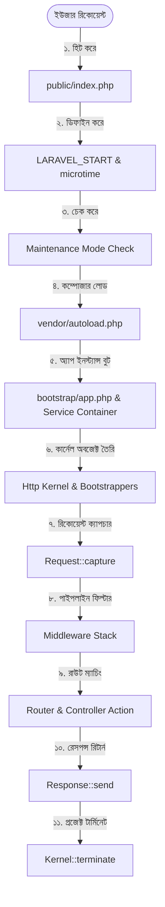

# মডিউল ৮: রিকোয়েস্ট লাইফসাইকেল ও কার্নেল (Request-Response Lifecycle & Kernel)

> [!IMPORTANT]
> **★ ইন্টারভিউয়ের জন্য গুরুত্বপূর্ণ প্রশ্ন:** লারাভেলের রিকোয়েস্ট লাইফসাইকেল (Request Lifecycle) ও কার্নেল (Kernel) কীভাবে কাজ করে আলোচনা কর

লারাভেলে একটি রিকোয়েস্ট আসার পর থেকে তার রেসপন্স পাঠানো পর্যন্ত ব্যাকএন্ডে ইন্টারনালি অনেকগুলো জটিল ও সুশৃঙ্খল ধাপ পার করতে হয়। একেই বলা হয় **Request-Response Lifecycle**। এই চ্যাপ্টারে আমরা একদম কোর লেভেলে গিয়ে লারাভেল কার্নেল ও লাইফসাইকেলের অভ্যন্তরীণ মেকানিজম নিয়ে বিস্তারিত আলোচনা করব।

---

## ১. কার্নেল কী? (What is a Kernel?) ★

> [!NOTE]
> সাধারণ অর্থে **Kernel** বলতে বোঝায় কোনো সিস্টেমের একদম কোর বা কেন্দ্রবিন্দুকে। যেমন: লিনাক্স অপারেটিং সিস্টেমের (Linux OS) মূল হৃদয় হলো তার লিনাক্স কার্নেল, যার সাথে অন্যান্য সার্ভিস বা হার্ডওয়্যারগুলো যোগাযোগ স্থাপন করে।

লারাভেলেও কার্নেল হলো পুরো ফ্রেমওয়ার্কের কোর বা সেন্ট্রাল প্রসেসর। লারাভেলে মূলত **২টি কার্নেল** রয়েছে:
1. **HTTP Kernel (`app/Http/Kernel.php`):** সমস্ত ওয়েব রিকোয়েস্ট হ্যান্ডেল করতে এটি ব্যবহৃত হয়।
2. **Console Kernel (`app/Console/Kernel.php`):** সিএলআই (CLI) বা আর্টিসানের সব কাস্টম ও শিডিউল কমান্ডগুলো হ্যান্ডেল করতে এটি ব্যবহৃত হয়।

---

## ২. রিকোয়েস্ট লাইফসাইকেলের প্রতিটি ধাপের গভীর বিশ্লেষণ ★

ইউজার যখন ব্রাউজারে এন্টার চাপেন, তখন লারাভেলের প্রজেক্টে একের পর এক নিচের ক্রমানুযায়ী ধাপগুলো চলতে থাকে:



### ধাপ ১: প্রবেশদ্বার (Entry Point — `public/index.php`)
যেকোনো ওয়েব রিকোয়েস্টের সর্বপ্রথম প্রবেশদ্বার বা এন্ট্রি পয়েন্ট হলো **`public/index.php`** ফাইল। 

### ধাপ ২: সময় গণনা শুরু (`LARAVEL_START`)
`index.php` ফাইলের একদম শুরুতেই পিএইচপির `microtime(true)` ফাংশন ব্যবহার করে নিচের টাইমটি ডিফাইন করা হয়:
```php
define('LARAVEL_START', microtime(true));
```
এটি মূলত ডিবাগিং পারপাসে এবং অ্যাপ্লিকেশনটি স্টার্ট হতে ও রিকোয়েস্ট হ্যান্ডেল করতে টোটাল কত মিলি-সেকেন্ড সময় নিচ্ছে, তা গণনা করতে ব্যবহৃত হয়।

### ধাপ ৩: মেইনটেইন্যান্স মোড চেক (Maintenance Mode Check)
এরপর ফাইলটিতে নিচের শর্তটি চেক করা হয়:
```php
if (file_exists($maintenance = __DIR__.'/../storage/framework/maintenance.php')) {
    require $maintenance;
}
```
যদি আপনার প্রজেক্টটি মেইনটেইন্যান্স মোডে থাকে (`php artisan down` করা থাকে), তবে লারাভেল এখান থেকেই ইউজারের কাছে একটি মেইনটেইন্যান্স রেসপন্স পাঠিয়ে দেয়, যাতে ডাটাবেজ বা অ্যাপ্লিকেশনের ওপর অতিরিক্ত চাপ না পড়ে।

### ধাপ ৪: অটোলোডার লোড করা
এরপর কম্পোজার জেনারেটেড ফাইল লোড করতে নিচের কোডটি রান হয়:
```php
require __DIR__.'/../vendor/autoload.php';
```

### ধাপ ৫: সার্ভিস কন্টেইনার বুট করা (`bootstrap/app.php`)
লারাভেলের সমস্ত বুটস্ট্র্যাপিং এবং ডিপেন্ডেন্সি ম্যানেজ করার জন্য **Service Container** তৈরি করতে নিচের ফাইলটি রিকোয়ার করা হয়:
```php
$app = require_once __DIR__.'/../bootstrap/app.php';
```
এটি মূলত `bootstrap/app.php` ফাইলে লারাভেলের প্রজেক্ট ইনস্ট্যান্স তৈরি করে এবং সমস্ত ওওপি বাইন্ডিংগুলো সেটআপ করে রিটার্ন করে। এটিই হলো লারাভেলের **Heart**।

### ধাপ ৬: কার্নেল ইনস্ট্যান্স তৈরি করা
সার্ভিস কন্টেইনার তৈরি হওয়ার পর, `index.php` ফাইলটি কন্টেইনার থেকে কার্নেল ক্লাসের অবজেক্ট তৈরি করে:
```php
$kernel = $app->make(Illuminate\Contracts\Http\Kernel::class);
```
এই কার্নেলটি মূলত বেজ ক্লাস `Illuminate\Foundation\Http\Kernel` কে এক্সটেন্ড করে।

### ধাপ ৭: বুটস্ট্র্যাপার্স লোড করা (Bootstrappers Stack) ★
কার্নেলটি তার কাজ শুরু করার পূর্বে পর্যায়ক্রমে নিচের বুটস্ট্র্যাপার্স ক্লাসগুলো দিয়ে অ্যাপ্লিকেশনটি কনফিগার করে নেয়:
```php
protected $bootstrappers = [
    \Illuminate\Foundation\Bootstrap\LoadEnvironmentVariables::class, // ১. .env ভেরিয়েবল লোড
    \Illuminate\Foundation\Bootstrap\LoadConfiguration::class,        // ২. config/ ফাইলগুলো লোড
    \Illuminate\Foundation\Bootstrap\HandleExceptions::class,         // ৩. এরর হ্যান্ডলিং রেডি করা
    \Illuminate\Foundation\Bootstrap\RegisterFacades::class,          // ৪. Facades রেজিস্টার করা
    \Illuminate\Foundation\Bootstrap\RegisterProviders::class,        // ৫. Service Providers রেজিস্টার
    \Illuminate\Foundation\Bootstrap\BootProviders::class,            // ৬. Providers বুট করা
];
```

### ধাপ ৮: রিকোয়েস্ট ক্যাপচার করা (Request Capture)
ব্রাউজার থেকে হেডার, বডি বা কুয়েরি প্যারামিটারসহ যা যা ডেটা এসেছে, সেগুলোকে নিয়ে একটি চমৎকার অবজেক্ট তৈরি করা হয়:
```php
$response = $kernel->handle(
    $request = Illuminate\Http\Request::capture()
);
```
`handle()` মেথডের মধ্যে এই ক্যাপচার করা রিকোয়েস্ট অবজেক্টটি পাস করা হয়।

### ধাপ ৯: রাউট ও মিডলওয়্যার পাইপলাইন
কার্নেল রিকোয়েস্টটিকে রাউটারের মাধ্যমে পাস করে। তবে রাউটার কন্ট্রোলারে যাওয়ার আগে রিকোয়েস্টটিকে একাধিক **Middleware** (যেমন: Auth, CSRF Token Check) দিয়ে ফিল্টার করা হয়। মিডলওয়্যার পার হলে রাউটার ম্যাচিং কন্ট্রোলারের অ্যাকশন বা ভিউ রিটার্ন করে।

### ধাপ ১০: রেসপন্স পাঠানো (Send Response)
কন্ট্রোলার থেকে আসা রেসপন্সটি ব্রাউজারের উদ্দেশ্যে পাঠিয়ে দেওয়া হয়:
```php
$response->send();
```

### ধাপ ১১: লাইফসাইকেল টার্মিনেশন (Termination)
রেসপন্স পাঠানো শেষ হয়ে গেলে, কার্নেল সমস্ত ব্যাকগ্রাউন্ড কাজ কমপ্লিট করতে টার্মিনেশন মেথড কল করে এবং মেমরি রিলিজ করে দেয়:
```php
$kernel->terminate($request, $response);
```
