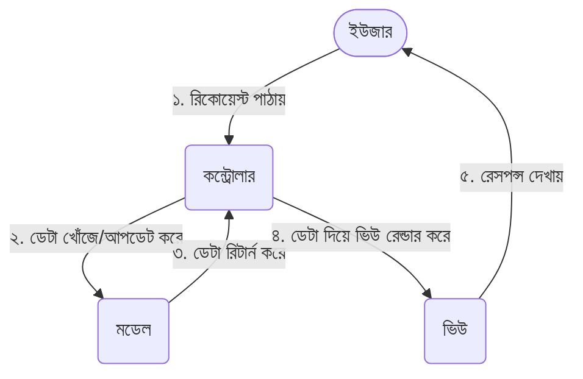

# মডিউল ৬: এমভিসি আর্কিটেকচার (MVC Architecture Pattern)

ওয়েব অ্যাপ্লিকেশন ডেভেলপমেন্টের ক্ষেত্রে **MVC (Model-View-Controller)** হলো অন্যতম একটি জনপ্রিয় এবং বহুল ব্যবহৃত আর্কিটেকচারাল ডিজাইন প্যাটার্ন। এই চ্যাপ্টারে আমরা জানব MVC প্যাটার্নটি কীভাবে কাজ করে এবং কীভাবে একটি সিম্পল MVC ফ্রেমওয়ার্ক তৈরি করা যায়।

---

## ১. এমভিসি (MVC) কী?

একটি বড় প্রজেক্টে যখন আমরা সব কোড (ডাটাবেজ কানেকশন, লজিক, এইচটিএমএল ডিজাইন) একটি মাত্র ফাইলের ভেতর লেখা শুরু করি, তখন কোডটি অত্যন্ত অগোছালো হয়ে পড়ে। একে বলা হয় **Spaghetti Code** বা জগাখিচুড়ি কোড। এই কোড পরবর্তী সময়ে মেইনটেইন বা আপডেট করা অসম্ভব হয়ে পড়ে।

এই সমস্যার সমাধান করতেই এসেছে **MVC** প্যাটার্ন। এটি আপনার অ্যাপ্লিকেশনের পুরো কোডবেসকে ৩টি প্রধান ভাগে ভাগ করে দেয়:
1. **Model (মডেল)** - ডেটা এবং লজিক
2. **View (ভিউ)** - ইউজার ইন্টারফেস বা ডিজাইন
3. **Controller (কন্ট্রোলার)** - ব্রেন বা নিয়ন্ত্রক



---

## ২. ৩টি অংশের বিস্তারিত ভূমিকা ★

> [!IMPORTANT]
> **★ ইন্টারভিউয়ের জন্য গুরুত্বপূর্ণ প্রশ্ন:** Model, View এবং Controller এর কাজগুলো সংক্ষেপে ব্যাখ্যা করুন।

### ক. Controller (কন্ট্রোলার) — অ্যাপ্লিকেশনের "মস্তিষ্ক"
কন্ট্রোলার হলো পুরো অ্যাপ্লিকেশনের ম্যানেজার বা ব্রেন। এর কাজ হলো ইউজার বা ক্লায়েন্টের কাছ থেকে আসা রিকোয়েস্ট গ্রহণ করা এবং সিদ্ধান্ত নেওয়া যে এরপর কী করতে হবে।
- **কাজ:** 
  - ইউজারের রিকোয়েস্ট বা ইনপুট ডেটা প্রসেস ও ভ্যালিডেশন করে।
  - কোনো ডেটার প্রয়োজন হলে তা **Model** থেকে সংগ্রহ করে।
  - সংগৃহীত ডেটা দিয়ে নির্দিষ্ট **View** ফাইলটিকে রেন্ডার করে ইউজারের কাছে ফেরত পাঠায়।
  - এটি কোনো সরাসরি ডাটাবেজ কোয়েরি লেখে না বা সরাসরি এইচটিএমএল ভিউ ডিজাইন করে না—শুধুমাত্র এদের মধ্যে সমন্বয়কারী হিসেবে কাজ করে।

### খ. Model (মডেল) — ডেটা ও বিজনেস লজিক
মডেল হলো আপনার অ্যাপ্লিকেশনের ডেটার প্রতিচ্ছবি। ডাটাবেজ বা যেকোনো ফাইল সোর্সের সাথে যোগাযোগের মূল কাজটি এখানে করা হয়।
- **কাজ:** 
  - ডাটাবেজে নতুন ডেটা রাইট করা, রিড করা, আপডেট করা বা ডিলিট করা (CRUD)।
  - বিজনেস লজিক বা গাণিতিক হিসাব-নিকাশ ম্যানেজ করা।
  - ডাটাবেজের টেবিলগুলোর মধ্যকার সম্পর্ক (Relationship) ডিফাইন করা।

### গ. View (ভিউ) — ইউজার ইন্টারফেস (UI)
ভিউ হলো অ্যাপ্লিকেশনের সেই অংশ যা সরাসরি ইউজারের ব্রাউজারে প্রদর্শিত হয়।
- **কাজ:**
  - ডেটাকে সুন্দর ডিজাইনে (HTML, CSS, JS এর মাধ্যমে) উপস্থাপন করা।
  - কন্ট্রোলারের কাছ থেকে পাওয়া ডেটা ডায়নামিক্যালি ব্রাউজারে শো করা।
  - এতে কোনো জটিল লজিক বা ডাটাবেজ কোয়েরি থাকা যাবে না। শুধুমাত্র সাধারণ লুপ বা ইফ-এলস কন্ডিশন থাকতে পারে।

---

## ৩. এমভিসি যেভাবে কাজ করে (MVC Lifecycle)

ইউজার যখন ব্রাউজারে কোনো লিঙ্ক ব্রাউজ করেন, তখন নিচের ধাপগুলো সম্পন্ন হয়:
1. ইউজার একটি ইউআরএল হিট করেন (যেমন: `www.example.com/users`)।
2. রাউটার চেক করে এই ইউআরএলটির জন্য কোন কন্ট্রোলারটি দায়িত্বপ্রাপ্ত।
3. **Controller** রিকোয়েস্টটি রিসিভ করে।
4. কন্ট্রোলার বুঝতে পারে যে তাকে সব ইউজারের তালিকা দেখাতে হবে। তাই সে **Model**-কে বলে, "আমাকে ডাটাবেজ থেকে সব ইউজারের লিস্ট এনে দাও।"
5. **Model** ডাটাবেজে কোয়েরি চালিয়ে ইউজারের লিস্ট এনে কন্ট্রোলারকে বুঝিয়ে দেয়।
6. **Controller** সেই ডেটা নিয়ে নির্দিষ্ট **View** ফাইলের কাছে পাঠায়।
7. **View** ডেটাগুলোকে সুন্দর একটি এইচটিএমএল টেবিলে সাজিয়ে নেয়।
8. সবশেষে কন্ট্রোলার সেই রেন্ডার হওয়া এইচটিএমএল পেজটি রেসপন্স হিসেবে ইউজারের ব্রাউজারে পাঠিয়ে দেয়।

---

## ৪. কীভাবে একটি কাস্টম এমভিসি ফ্রেমওয়ার্ক বানাবেন? (Concept)

পিএইচপি দিয়ে একটি বেসিক কাস্টম MVC ফ্রেমওয়ার্ক বানানোর জন্য প্রধানত ৪টি জিনিসের প্রয়োজন:

### ক. Front Controller ও Routing
সব রিকোয়েস্ট সর্বপ্রথম আসবে `index.php` ফাইলে। রাউটার ইউআরএল ভেঙে সিদ্ধান্ত নেবে কোন কন্ট্রোলার মেথডটি রান হবে।
```php
// simple router logic in index.php
$url = $_GET['url'] ?? '/';

if ($url === '/') {
    $controller = new HomeController();
    $controller->index();
} elseif ($url === 'about') {
    $controller = new HomeController();
    $controller->about();
}
```

### খ. Base Controller
সব কন্ট্রোলার যেন সহজেই ভিউ রেন্ডার করতে পারে সেজন্য একটি বেজ কন্ট্রোলার ক্লাস থাকে:
```php
class Controller {
    // View লোড করার হেল্পার মেথড
    public function view($viewName, $data = []) {
        // অ্যারের কি-গুলোকে ভেরিয়েবলে রূপান্তর করে
        extract($data);
        
        $viewFile = "../views/{$viewName}.php";
        if (file_exists($viewFile)) {
            require_once $viewFile;
        } else {
            die("View file not found.");
        }
    }
}
```

### গ. Child Controller
কন্ট্রোলারটি বেজ কন্ট্রোলারকে এক্সটেন্ড (Extend) করবে এবং লজিক লিখে ভিউ রিটার্ন করবে:
```php
class UserController extends Controller {
    public function index() {
        // মডেল থেকে ডেটা আনা (কাল্পনিক উদাহরণ)
        $userModel = new UserModel();
        $users = $userModel->getAllUsers();
        
        // ভিউ রেন্ডার করা এবং ডেটা পাস করা
        return $this->view('users/index', ['users' => $users]);
    }
}
```

### ঘ. View (ব্লেড বা সাধারণ পিএইচপি ফাইল)
ভিউ ফাইলটিতে আমরা পিএইচপি শর্ট ট্যাগ বা লুপ দিয়ে ডেটা ডায়নামিক্যালি প্রিন্ট করব:
```php
<!-- views/users/index.php -->
<h1>ইউজার তালিকা</h1>
<ul>
    <?php foreach ($users as $user): ?>
        <li><?= htmlspecialchars($user['name']) ?> (<?= htmlspecialchars($user['email']) ?>)</li>
    <?php endforeach; ?>
</ul>
```

---

## ৫. এমভিসি (MVC) এর সুবিধা

- **Separation of Concerns (RoC):** কোডের প্রতিটি অংশের কাজ নির্দিষ্ট থাকায় প্রজেক্ট অনেক গোছানো থাকে।
- **প্যারালাল ডেভেলপমেন্ট:** একজন ডিজাইনার যখন ভিউ ফাইলের ডিজাইন আপডেট করছেন, ঠিক তখনই একজন ব্যাকএন্ড ডেভেলপার কন্ট্রোলার বা মডেলের লজিক নিয়ে কোনো কনফ্লিক্ট ছাড়াই কাজ করতে পারেন।
- **কোড রিইউজেবিলিটি:** একই মডেলের লজিক আমরা একাধিক কন্ট্রোলারে বা এপিআই তৈরিতে ব্যবহার করতে পারি।
- **সহজ ডিবাগিং:** কোনো এরর দেখা দিলে আমরা খুব সহজেই বুঝতে পারি যে সমস্যাটি ডাটাবেজ মডেলে, লজিকে নাকি ডিজাইনে।
