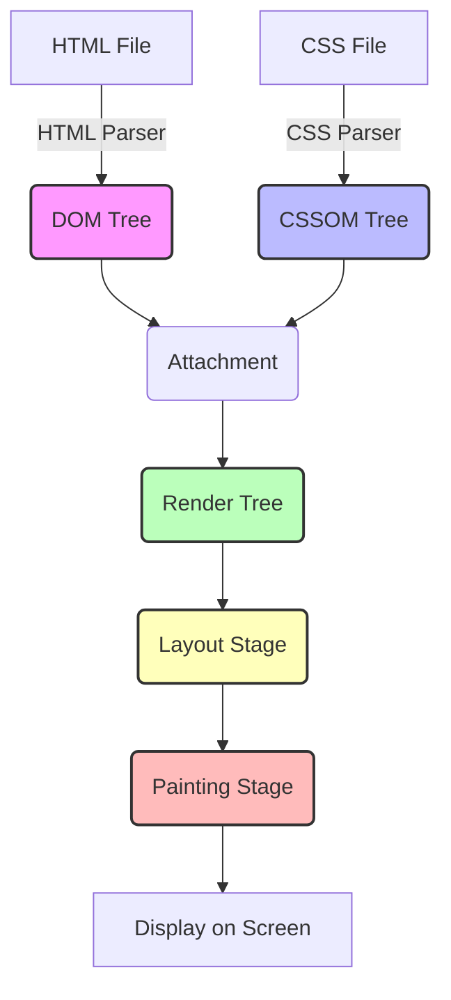
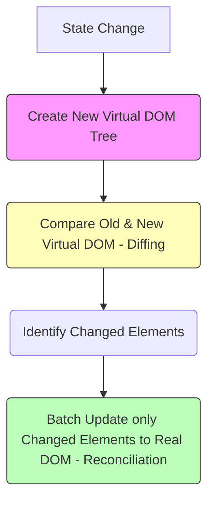

# ভার্চুয়াল ডম ব্যাখ্যা (React Virtual DOM Explained)

রিঅ্যাক্টের অনন্য পারফরম্যান্স এবং জনপ্রিয়তার পেছনে সবচেয়ে বড় ভূমিকা রেখেছে এর **Virtual DOM** বা ভার্চুয়াল ডম ধারণাটি। এই চ্যাপ্টারে আমরা জানবো ভার্চুয়াল ডম কী, এটি ব্রাউজারের আসল ডম (Real DOM) থেকে কীভাবে আলাদা এবং এটি কীভাবে কাজ করে।

---

## ১. ব্রাউজার ডম এবং এর রেন্ডারিং ওয়ার্কফলো

আমরা যখনই ব্রাউজারে কোনো HTML পেজ লোড করি, তখন ব্রাউজারের ইন্টারনাল রেন্ডারিং ইঞ্জিন বেশ কয়েকটি জটিল ধাপের মধ্য দিয়ে আমাদের পেজটি স্ক্রিনে প্রদর্শন করে। চলুন এই ওয়ার্কফলোটি বুঝে নেওয়া যাক:



1. **DOM Tree তৈরি:** ব্রাউজারের HTML পার্সার HTML কোড পড়ে প্রতিটি এলিমেন্টকে একেকটি নোড হিসেবে রূপান্তর করে একটি **DOM Tree** তৈরি করে।
2. **CSSOM Tree তৈরি:** একই সাথে CSS ফাইল ও স্টাইল রুলস পার্স করে **CSSOM (CSS Object Model)** ট্রি তৈরি করা হয়।
3. **Render Tree তৈরি:** ডম ট্রি এবং সিএসএসওএম ট্রি একত্রিত হয়ে তৈরি হয় **Render Tree**। এতে শুধুমাত্র স্ক্রিনে প্রদর্শিত হবে এমন উপাদান ও তাদের স্টাইল থাকে (যেমন `display: none` যুক্ত উপাদান এখানে থাকে না)।
4. **Layout (বিন্যাস):** এই ধাপে ব্রাউজার হিসাব করে যে স্ক্রিনের কোন পজিশনে কোন উপাদানটি বসবে এবং তাদের সুনির্দিষ্ট আকার (coordinates) কেমন হবে।
5. **Painting (অঙ্কন):** সব হিসাব সম্পন্ন হওয়ার পর ব্রাউজার স্ক্রিনে পিক্সেলগুলো আঁকে এবং আমরা পেজটি দেখতে পাই।

### সমস্যা কোথায়?
আমরা যখনই জাভাস্ক্রিপ্ট দিয়ে ডমের কোনো উপাদান আপডেট করি (যেমন: `innerHTML` পরিবর্তন করা), ব্রাউজারকে পুরো পেজের বা নির্দিষ্ট ব্লকের লেআউট পুনরায় ক্যালকুলেট করতে হয় এবং রিফ্লো ও পেইন্টিং রান করতে হয়। এই ডম অপারেশনগুলো অত্যন্ত ধীরগতির (slow) এবং ইন-এফিসিয়েন্ট। যদি একটি পেজে হাজার হাজার ডম অপারেশন করতে হয়, তবে ওয়েবসাইটটি ধীরগতির বা ল্যাগি হয়ে পড়ে।

---

## ২. সমাধান: ব্যাচ আপডেট (Batch Update)

ডম অপারেশন দ্রুত করার জন্য আমরা দুটি জিনিস করতে পারি:
1. ডম অপারেশনের সংখ্যা কমিয়ে আনা।
2. একাধিক ডম আপডেট এক এক করে না করে একবারে (Batch Update) করা।

চলুন ভ্যানিলা জাভাস্ক্রিপ্ট দিয়ে তৈরি একটি উদাহরণ দেখা যাক:

**dom.html**
```html
<body>
    <div class="container"></div>
    <script src="./dom.js"></script>
</body>
```

**dom.js**
```javascript
let array = [];
let increment = 0;
let container = document.querySelector('.container');

// ১. দ্রুত পদ্ধতি (Fast Method) - মাত্র ১ বার DOM অপারেশন করা হচ্ছে
while (increment < 10000) {
  array.push(++increment);
}
container.innerHTML = array.join(' '); 
// এখানে ১ থেকে ১০,০০০ পর্যন্ত উপাদানগুলোকে একটি স্ট্রিং-এ জয়েন করে 
// সবগুলোকে একসাথে কন্টেইনারে দিয়ে দেওয়া হয়েছে। ডম অপারেশন একবার হওয়াতে এটি অত্যন্ত দ্রুত কাজ করে।

// ২. ধীর পদ্ধতি (Slow Method) - ১০,০০০ বার DOM অপারেশন করা হচ্ছে
/*
while (increment < 10000) {
  increment++;
  container.innerHTML += increment + ' ';
}
*/
// এখানে প্রতিবার লুপ ঘোরার সময় একটি করে এলিমেন্ট ডমে রেন্ডার করা হচ্ছে। 
// ফলে ব্রাউজারকে ১০,০০০ বার রিফ্লো ও পেইন্টিং করতে হচ্ছে, যা পেজ লোডিংকে অত্যন্ত ধীর করে দেয়।
```

---

## ৩. ভার্চুয়াল ডম কীভাবে কাজ করে?

রিঅ্যাক্ট সরাসরি ব্রাউজার ডমে হাত দেয় না। এর পরিবর্তে রিঅ্যাক্ট মেমরিতে আসল ডমের একটি হালকা অনুলিপি বা রেপ্লিকা তৈরি করে রাখে, যাকে বলা হয় **Virtual DOM**। যেহেতু এটি সাধারণ জাভাস্ক্রিপ্ট অবজেক্ট, তাই এতে পরিবর্তন আনা অত্যন্ত দ্রুত ও সহজ।

রিঅ্যাক্ট মেমরিতে ভার্চুয়াল ডমের দুটি স্ন্যাপশট ধরে রাখে:
1. **পরিবর্তনের আগের অবস্থা (Previous Virtual DOM)**
2. **পরিবর্তনের পরের অবস্থা (Current/Updated Virtual DOM)**

স্টেট পরিবর্তিত হলে রিঅ্যাক্ট কীভাবে কাজ করে, তা নিচে তুলে ধরা হলো:



- **Diffing Algorithm:** নতুন ও পুরাতন ভার্চুয়াল ডমের মধ্যে তুলনা করে সুনির্দিষ্ট কোন অংশটি পরিবর্তিত হয়েছে তা বের করার জন্য রিঅ্যাক্ট একটি বিশেষ অ্যালগরিদম ব্যবহার করে, একে **Diffing Algorithm** বলে।
- **Reconciliation:** ডিফিং প্রসেসে চিহ্নিত পরিবর্তনগুলো রিঅ্যাক্ট ব্রাউজারের আসল ডমে ব্যাচ আপডেট আকারে যুক্ত করে। এই সমন্বয় করার প্রক্রিয়াকে বলা হয় **Reconciliation**।

---

## ৪. প্র্যাকটিক্যাল ডেমো: ভ্যানিলা ডম বনাম রিঅ্যাক্ট ভার্চুয়াল ডম

আমরা পেইন্ট ফ্ল্যাশিং (Paint Flashing) দিয়ে দেখতে পারি কীভাবে ভ্যানিলা ডম পেজের পুরো লিস্ট আপডেট করে এবং রিঅ্যাক্ট কীভাবে শুধুমাত্র নির্দিষ্ট উপাদান আপডেট করে।

### ক. ভ্যানিলা জাভাস্ক্রিপ্ট সংস্করণ

**index.html**
```html
<div class="container">
    <ul id="fruits"></ul>
    <br/>
    <input type="text" id="input" />
    <button id="button" onclick="addItem()">Add Item</button>
</div>
<script src="./script.js"></script>
```

**script.js**
```javascript
Array.prototype.myPush = function (...args) {
    this.push(args[0]);
    init(); // ডেটা পুশ হওয়ার পর লিস্ট আপডেট করবে
}

const display = document.getElementById("fruits");
let fruits = ['mango', 'guava', 'apple', 'orange'];

const init = function () {
    display.innerHTML = '';
    fruits.sort().forEach(fruit => {
        let item = document.createElement("li");
        item.textContent = fruit;
        display.appendChild(item);
    });
};

const addItem = function () {
    const inputVal = document.getElementById("input").value;
    if(inputVal) {
        fruits.myPush(inputVal);
    }
}

// প্রারম্ভিক রেন্ডার
init();
```

### খ. রিঅ্যাক্ট সংস্করণ

**react.html**
```html
<body>
    <div id="root"></div>
    <!-- Load React & ReactDOM CDN & Babel -->
    <script src="https://unpkg.com/react@17/umd/react.development.js" crossorigin></script>
    <script src="https://unpkg.com/react-dom@17/umd/react-dom.development.js" crossorigin></script>
    <script src="https://unpkg.com/babel-standalone@6/babel.min.js"></script>
    <script type="text/babel" src="Fruits.js"></script>
</body>
```

**Fruits.js**
```javascript
const Fruits = () => {
  const [fruit, setFruit] = React.useState("");
  const [fruits, setFruits] = React.useState(["mango", "guava", "apple", "orange"]);

  return (
    <div className="container">
      <ul>
        {fruits.sort().map((f, index) => (
          <li key={index}>{f}</li>
        ))}
      </ul>
      <br/>
      <p>
        <input type="text" value={fruit} onChange={(e) => setFruit(e.target.value)} />
      </p>
      <button onClick={() => {
        if(fruit) {
          setFruits([...fruits, fruit]);
          setFruit("");
        }
      }}>
        Add Item
      </button>
    </div>
  );
};

ReactDOM.render(<Fruits />, document.querySelector("#root"));
```

### পেইন্ট ফ্ল্যাশিং এর মাধ্যমে রেন্ডারিং পরীক্ষা
ক্রোম ব্রাউজারে ইনস্পেক্ট এলিমেন্ট থেকে **More tools > Rendering**-এ গিয়ে **Paint flashing** অপশনটি অন করুন।
- **ভ্যানিলা সংস্করণে** যখনই আমরা নতুন আইটেম যুক্ত করি, পুরো লিস্টটি সবুজ রঙের বক্সে ফ্ল্যাশ করবে। অর্থাৎ, পুরো ডম ট্রি নতুন করে রেন্ডার হচ্ছে।
- **রিঅ্যাক্ট সংস্করণে** নতুন আইটেম যুক্ত করলে দেখা যাবে পেজের আগের আইটেমগুলো একটুও ফ্ল্যাশ করছে না; শুধুমাত্র নতুন যুক্ত হওয়া উপাদানটি ফ্ল্যাশ করছে। ভার্চুয়াল ডম থাকার কারণেই রিঅ্যাক্ট সফলভাবে এই অপ্রয়োজনীয় রি-রেন্ডারিং এড়াতে পারছে।

---

## ৫. ডম প্রোফাইলিং ও পারফরম্যান্স তুলনা

আমরা যদি সাধারণ পেজ রেন্ডারিং ক্রোম ডেভটুলসের Performance ট্যাব দিয়ে প্রোফাইল করি, তবে নিচের মতো চিত্র দেখতে পাব:

| Metric | Normal HTML | jQuery | React |
| :--- | :---: | :---: | :---: |
| **Loading** | 10ms | 8ms | 36ms |
| **Scripting** | 53ms | 39ms | 340ms |
| **Rendering** | 1ms | 1ms | 12ms |
| **Painting** | 0ms | 0ms | 2ms |

### রিঅ্যাক্ট কি তবে ধীরগতির?
ছোট পেজ রেন্ডার করার জন্য রিঅ্যাক্ট আসলে সাধারণ জাভাস্ক্রিপ্ট বা jQuery-এর চেয়ে কিছুটা বেশি সময় (Scripting-এ ৩৪০ms) নেয়। কারণ একে ব্রাউজারে রান হওয়ার পর মেমরিতে ভার্চুয়াল ডম অবজেক্ট তৈরি ও ডিফিং লজিক লোড করতে হয়। 

কিন্তু যখন অ্যাপ্লিকেশনটি একটি বড় স্কেলের সিঙ্গেল পেজ অ্যাপ্লিকেশন (SPA) হয়ে দাঁড়ায়, যেখানে পেজ রিলোড ছাড়াই মিনিটে হাজার হাজার উপাদান ডাইনামিকালি চেঞ্জ হতে থাকে, তখন ভ্যানিলা জাভাস্ক্রিপ্ট বা jQuery দিয়ে ডম হ্যান্ডেল করা চরম পারফরম্যান্স বিপর্যয় ডেকে আনে। সেখানে রিঅ্যাক্ট তার ভার্চুয়াল ডম ও ব্যাচ আপডেটের মাধ্যমে অত্যন্ত দ্রুত এবং মসৃণ পারফরম্যান্স নিশ্চিত করে।
